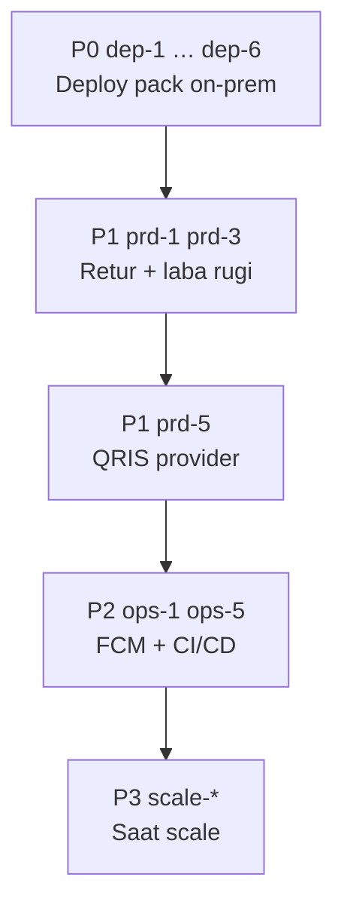

# Backlog — Fitur Belum Diterapkan

**Produk:** ApotikFlow  
**Tanggal:** Juni 2026  
**Relasi:** Melanjutkan `referensi/9. audit optimasi.md` (§6 sudah 22/22 selesai) dan `referensi/8. roadmap.md`

Legenda status: `[ ]` belum · `[~]` sebagian · `[x]` selesai

---

## Ringkasan progres

| Tier | Total | Belum | Sebagian |
|------|-------|-------|----------|
| P0 — Beli putus & go-live | 6 | 0 | 0 |
| P1 — Gap PRD | 5 | 0 | 1 |
| P2 — Operasional | 6 | 0 | 0 |
| P3 — Scale & hardening | 8 | 0 | 1 |
| **Jumlah** | **25** | **0** | **1** |

> **MVP inti sudah jalan.** Daftar ini untuk production, penjualan beli putus, dan keselarasan PRD.

---

## P0 — Beli putus & go-live (prioritas tertinggi)

| ID | Item | Status | Catatan / lokasi |
|----|------|--------|------------------|
| `dep-1` | Unit file **systemd** untuk API | `[x]` | `deploy/systemd/apotikflow-api.service` |
| `dep-2` | Contoh **nginx.conf** (API reverse proxy + Flutter web) | `[x]` | `deploy/nginx/apotikflow.conf.example` |
| `dep-3` | **Dockerfile production** + compose prod | `[x]` | `api/Dockerfile`, `docker-compose.prod.yml` |
| `dep-4` | Skrip **`build-release.sh`** (backend zip + instruksi Flutter) | `[x]` | `scripts/build-release.sh` → folder `release/` |
| `dep-5` | UI/petunjuk **restart API** setelah wizard DB | `[x]` | Dialog di `database_setup_page.dart` saat `restart_required` |
| `dep-6` | **Ganti password wajib** akun seed (superadmin/owner) | `[x]` | `must_change_password` + `/change-password` + guard API |

### Checklist P0

- [x] `dep-1` systemd service
- [x] `dep-2` nginx example
- [x] `dep-3` Dockerfile production
- [x] `dep-4` build-release script
- [x] `dep-5` restart API UX setelah apply DB
- [x] `dep-6` ganti password wajib pasca-instalasi

---

## P1 — Gap PRD (`referensi/1. prd.md`)

| ID | Item | Status | PRD | Catatan |
|----|------|--------|-----|---------|
| `prd-1` | **Retur / refund** kasir | `[x]` | §5 Kasir — Retur | `POST /orders/:id/refund` + tombol retur di `payment_detail_page.dart` |
| `prd-2` | **Split payment** (bayar campuran) | `[x]` | §4.6 POS | `PayOrderDto.splits[]` + UI bayar campuran di `cashier_pay_page.dart` |
| `prd-3` | **Laporan laba rugi** (margin) | `[x]` | §4.7 Laporan | `GET /reports/profit-loss` + tab Laba Rugi |
| `prd-4` | **Export Excel/PDF** laporan | `[x]` | Roadmap Fase 6 | Export Excel penjualan + laba rugi; PDF penjualan |
| `prd-5` | **QRIS provider sungguhan** (Xendit/Midtrans/dll.) | `[~]` | §4.6 QRIS | Adapter `xendit`/`midtrans`/`http` + `scripts/qris-mock-provider.mjs`; uji kredensial nyata belum |

### Checklist P1

- [x] `prd-1` Retur kasir (API + UI + stok balik)
- [x] `prd-2` Split payment
- [x] `prd-3` Endpoint + halaman laba rugi
- [x] `prd-4` Export Excel/PDF laporan owner
- [~] `prd-5` Integrasi QRIS provider (adapter HTTP ada; perlu uji provider nyata)

---

## P2 — Operasional & pengalaman pengguna

| ID | Item | Status | Catatan |
|----|------|--------|---------|
| `ops-1` | **FCM push** ke perangkat | `[x]` | `firebase_messaging` + token asli; butuh `dart-define` + `google-services.json` + `FIREBASE_*` API |
| `ops-2` | **Thermal printer** di semua flow | `[x]` | Settings + cetak kasir/cabang/staff/owner; TCP/IP; Bluetooth opsional roadmap |
| `ops-3` | **Login biometrik** | `[x]` | `local_auth` + simpan kredensial aman + tombol di `login_page.dart` |
| `ops-4` | **Billing SaaS otomatis** | `[x]` | `POST /billing/webhook`, `POST /billing/renewal-intent`, cron suspend; UI di `tenant_license_status_page.dart` |
| `ops-5` | **CI/CD pipeline** | `[x]` | `.github/workflows/ci.yml` — API lint/test/build + Flutter analyze |
| `ops-6` | **Aksesibilitas** penuh | `[x]` | Login, kasir, payment, barcode, order (`create`/`detail`), inventory (`stok`/`mutasi`/`terima`) |

### Checklist P2

- [x] `ops-1` FCM end-to-end (Flutter SDK + token asli; konfigurasi Firebase wajib)
- [x] `ops-2` Thermal: settings + semua laporan utama (Bluetooth opsional)
- [x] `ops-3` Login biometrik
- [x] `ops-4` Self-service billing SaaS (webhook + renewal intent + UI owner)
- [x] `ops-5` GitHub Actions: lint, test, build api + flutter analyze
- [x] `ops-6` Audit aksesibilitas (login, kasir, payment, order, inventory)

---

## P3 — Scale, keamanan lanjutan, dokumentasi

| ID | Item | Status | Catatan |
|----|------|--------|---------|
| `scale-1` | **Redis adapter** Socket.IO (multi-instance) | `[x]` | `events.gateway.ts` — aktif jika `REDIS_URL` di-set |
| `scale-2` | **Partition** tabel besar | `[~]` | `partition-strategy.md` + skrip awal `stock-movements-partition.sql`; swap produksi manual |
| `scale-3` | **Integration / E2E test** | `[x]` | `order-payment.e2e-spec.ts` + `license.e2e-spec.ts` |
| `scale-4` | **Monitoring** (Sentry / uptime) | `[x]` | `/health` + checks DB/Redis; `@sentry/nestjs` aktif jika `SENTRY_DSN` di-set |
| `scale-5` | **Load test** (target 10rb trx/hari) | `[x]` | `k6-smoke.js`, `k6-pos-flow.js`, `k6-10k-daily.js` — `scripts/load-test/README.md` |
| `scale-6` | **SSL pinning** (Flutter) | `[x]` | `ssl_pinning_*.dart` — opsional via `--dart-define`; mobile/desktop saja |
| `scale-7` | **Barcode scanner HID/USB** (PC kasir) | `[x]` | `BarcodeSearchField` + autofocus kasir (keyboard wedge) |
| `scale-8` | **Dokumentasi teknis** roadmap §18 | `[x]` | `referensi/12. dokumentasi teknis operasional.md` |

### Checklist P3

- [x] `scale-1` Redis pub/sub WebSocket
- [~] `scale-2` Partition DB — skrip `stock_movements` siap; aktivasi produksi manual
- [x] `scale-3` E2E order + payment + RBAC API
- [x] `scale-4` Health monitoring + Sentry SDK (`api/src/instrument.ts`)
- [x] `scale-5` k6 smoke + POS + beban 10rb/hari (`k6-10k-daily.js`)
- [x] `scale-6` SSL pinning opsional (`ENABLE_SSL_PINNING` + `SSL_PIN_SHA256`)
- [x] `scale-7` Scanner USB/HID via keyboard wedge
- [x] `scale-8` Dokumentasi teknis operasional

---

## Sudah diterapkan (referensi — jangan duplikasi)

Item berikut **bukan** backlog; tercatat agar tidak dikerjakan ulang.

| ID / area | Status |
|-----------|--------|
| Audit §6 (`sec-*`, `pay-1` env, `cash-*`, `proc-1`, `inv-1`, `lic-*`, `plat-1`, `off-1`, `rpt-1`, `ui-*`, `nice-*`) | `[x]` |
| Multi-cabang per user + peran per cabang | `[x]` |
| Wizard on-prem + Database On-Prem UI | `[x]` |
| **Atur alamat server** di halaman login (pre-login) | `[x]` |
| Pencarian global `/search` | `[x]` |
| Checklist kirim paket beli putus | `[x]` — `referensi/10. checklist beli putus.md` |
| Rollout `AsyncErrorView` halaman prioritas | `[x]` |
| Jejak transaksi pelanggan per periode | `[x]` — `GET /customers/:id/transactions` + `customer_detail_page.dart` |

---

## Urutan implementasi disarankan

### Sprint 1 (beli putus — ~1 minggu)

1. `dep-1` + `dep-2` + `dep-4`
2. `dep-5` + `dep-6`

### Sprint 2 (nilai bisnis PRD — ~2 minggu)

1. `prd-1` retur
2. `prd-3` laba rugi
3. `prd-4` export laporan

### Sprint 3 (opsional sesuai pasar)

1. `prd-5` QRIS
2. `ops-1` FCM
3. `ops-5` CI/CD

---

## Pemeliharaan dokumen

- Centang `[ ]` → `[x]` saat selesai; tambahkan tanggal di baris item.
- Sinkronkan dengan `referensi/9. audit optimasi.md` §10 jika item pindah ke “selesai”.
- Item P0 selesai → perbarui checklist di `referensi/10. checklist beli putus.md`.

---

*Dokumen backlog aktif — perbarui setiap sprint planning.*
