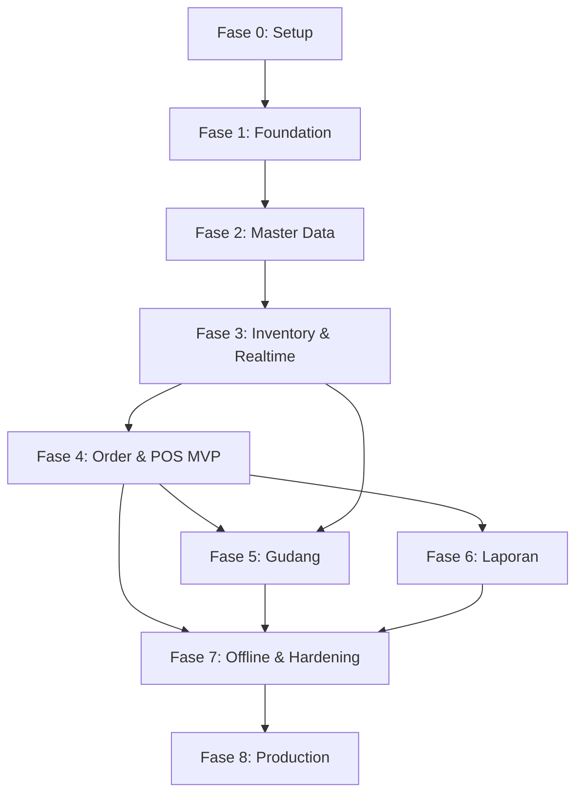

# Roadmap — ApotikFlow

**Produk:** ApotikFlow — Aplikasi Apotik Multi-Tenant Enterprise  
**Stack:** Flutter · Node.js (NestJS/Fastify) · PostgreSQL · Redis · Socket.IO · Docker/Kubernetes  
**Sumber:** PRD, ERD, Struktur Folder, Clean Architecture, Realtime Stock, API Design, UI/UX, Master Documentation

---

## 1. Visi & Tujuan

### Visi
Platform apotik modern yang mendukung banyak tenant, banyak cabang, dan operasional realtime — dari input pesanan pelayan di HP hingga pembayaran kasir, dengan stok yang selalu akurat dan tersinkron antar perangkat.

### Tujuan Utama (dari PRD)
| Area | Target |
|------|--------|
| Kecepatan input pesanan | < 1 menit |
| Sinkronisasi stok realtime | < 2 detik |
| Akurasi stok | > 99% |
| Uptime | 99.9% |
| Throughput kasir | > 100 transaksi/hari per kasir |
| Response API | < 300ms |

### KPI UX (dari UI Design)
| Role | Target |
|------|--------|
| Pelayan — 1 order | < 30 detik |
| Kasir — 1 pembayaran | < 15 detik |

---

## 2. Prinsip Pengembangan

Roadmap ini mengikuti urutan dependensi teknis:

```
Foundation → Data & Auth → Core Inventory → Order & Realtime → POS → Advanced → Production
```

**Aturan arsitektur (wajib di setiap fase):**
- Backend: multi-tenant filter (`tenant_id`) di semua query
- Stok: transaction + `FOR UPDATE` + reservation sebelum finalisasi
- Flutter: Clean Architecture (Presentation → Domain → Data)
- Realtime: WebSocket + Redis Pub/Sub untuk scaling
- Semua mutasi stok wajib lewat `stock_movements` (audit trail)

---

## 3. Ringkasan Fase

| Fase | Nama | Durasi Estimasi | Fokus |
|------|------|-----------------|-------|
| 0 | Persiapan & Setup | 2 minggu | Repo, CI, env, struktur project |
| 1 | Foundation | 3–4 minggu | DB, auth, tenant, branch, user |
| 2 | Master Data | 3 minggu | Obat, kategori, supplier, batch |
| 3 | Inventory & Realtime | 4 minggu | Stok, mutasi, WebSocket, reservation |
| 4 | Order & POS (MVP) | 4 minggu | Order pelayan, kasir, pembayaran |
| 5 | Gudang & Operasional | 3 minggu | Opname, transfer, expired |
| 6 | Laporan & Dashboard | 3 minggu | Analytics owner, export |
| 7 | Offline & Hardening | 3 minggu | Semi-offline, performance, security |
| 8 | Production & Scale | 2–4 minggu | DevOps, monitoring, UAT |

**Total estimasi:** ~27–32 minggu (~7–8 bulan) untuk produk lengkap  
**MVP siap uji coba:** selesai Fase 4 (~16 minggu / ~4 bulan)

---

## 4. Fase 0 — Persiapan & Setup (Minggu 1–2)

### Tujuan
Menyiapkan fondasi tim, repository, dan standar pengembangan.

### Backend
- [x] Inisialisasi project Node.js (NestJS direkomendasikan)
- [ ] Struktur folder: `src/modules`, `shared`, `infrastructure`, `websocket`, `jobs`, `config`
- [ ] Docker Compose: PostgreSQL, Redis, API
- [ ] Migration tool (Prisma / TypeORM / Knex)
- [ ] Environment: dev, staging, production
- [ ] Swagger `/docs` skeleton

### Flutter
- [ ] Inisialisasi project Flutter dengan struktur enterprise (`lib/app`, `core`, `shared`, `features`)
- [ ] Flavor: `main_dev`, `main_staging`, `main_production`
- [ ] Setup: Riverpod, GoRouter, Dio, get_it/injectable, Freezed
- [ ] Theme system (`colors`, `typography`, `spacing`, `radius`)
- [ ] Shared components dasar: `AppButton`, `AppTextField`, `AppScaffold`

### DevOps & Tim
- [ ] Git workflow & branching strategy (`main`, `develop`, `feat/*`)
- [ ] CI pipeline dasar (lint, test, build)
- [ ] Template PR & commit convention
- [ ] Dokumentasi onboarding developer

### Deliverable
✅ Project bisa di-run lokal (backend + DB + Flutter)  
✅ Struktur folder sesuai dokumen referensi

---

## 5. Fase 1 — Foundation (Minggu 3–6)

### Tujuan
Multi-tenant, autentikasi, cabang, dan RBAC — fondasi semua modul.

### Database (ERD Fase 1)
| Tabel | Prioritas |
|-------|-----------|
| `tenants` | P0 |
| `branches` | P0 |
| `users` | P0 |
| `audit_logs` | P1 |

### Backend API
| Modul | Endpoint | Status Target |
|-------|----------|---------------|
| Auth | `POST /auth/login`, `POST /auth/refresh`, `POST /auth/logout`, `GET /auth/me` | P0 |
| Tenant | `GET /tenants/current` | P0 |
| Branch | `GET /branches`, `POST /branches` | P0 |
| User | `GET /users`, `POST /users`, `PUT /users/:id/role` | P1 |

### Security
- [ ] JWT access + refresh token
- [ ] RBAC: OWNER, MANAGER, CASHIER, STAFF, WAREHOUSE
- [ ] Header: `Authorization`, `X-Tenant-ID`, `X-Branch-ID`
- [ ] Bcrypt password, rate limit, Helmet, CORS
- [ ] Middleware tenant isolation

### Flutter
| Feature | Screen / Modul |
|---------|----------------|
| `auth` | Login (email, password, cabang dropdown, biometric) |
| `tenant` | Context tenant (provider) |
| `branch` | Branch selector |
| `user_management` | List user, create user (Owner/Manager) |
| Routing | Auth guard, role-based redirect |

### Deliverable
✅ User bisa login, pilih cabang, dan diarahkan sesuai role  
✅ Data antar tenant terisolasi

---

## 6. Fase 2 — Master Data (Minggu 7–9)

### Tujuan
Katalog obat lengkap — fondasi inventory dan penjualan.

### Database
| Tabel | Prioritas |
|-------|-----------|
| `suppliers` | P0 |
| `medicine_categories` | P0 |
| `medicines` | P0 |
| `medicine_batches` | P0 |

### Backend API
| Modul | Endpoint |
|-------|----------|
| Medicine | `GET/POST/PUT/DELETE /medicines` |
| Supplier | CRUD suppliers (internal) |
| Upload | `POST /uploads` (gambar obat) |

### Flutter
| Feature | Screen |
|---------|--------|
| `medicine` | List, form (nama, barcode, kategori, harga, min stock) |
| `supplier` | List & form supplier |
| Integrasi | Barcode scanner di form obat |

### UI (dari Desain UI)
- Grid/table responsive
- Search + filter kategori
- Scan barcode saat input obat

### Deliverable
✅ Admin bisa kelola katalog obat per tenant  
✅ Barcode dan batch/expired siap dipakai modul stok

---

## 7. Fase 3 — Inventory & Realtime (Minggu 10–13)

### Tujuan
Stok akurat, reservation, dan sinkronisasi realtime — **inti diferensiasi produk**.

### Database
| Tabel | Prioritas |
|-------|-----------|
| `stocks` | P0 |
| `stock_movements` | P0 |

Index wajib:
```sql
CREATE INDEX idx_stocks_branch_medicine ON stocks(branch_id, medicine_id);
CREATE INDEX idx_stock_movements_created ON stock_movements(created_at);
```

### Backend — REST
| Endpoint | Fungsi |
|----------|--------|
| `GET /stocks` | List stok per cabang |
| `GET /stocks/realtime/:medicineId` | Stok available (qty - reserved) |
| `POST /stocks/mutation` | Adjustment manual |

### Backend — Realtime (kritis)
| Komponen | Implementasi |
|----------|--------------|
| WebSocket Gateway | Socket.IO + auth JWT |
| Redis Adapter | Pub/Sub lintas instance |
| Rooms | `tenant:{id}`, `branch:{id}` |
| Events | `stock.updated`, `stock.low`, `stock.expired` |

### Flow Reservation (wajib)
```
START TRANSACTION → SELECT ... FOR UPDATE → cek available
→ reserved_quantity += qty → COMMIT → emit stock.updated
```

### Flutter
| Modul | Komponen |
|-------|----------|
| `inventory` / `stock` | Stock list, stock detail drawer |
| `core/websocket` | `SocketService`, `SocketEvents`, handlers |
| `realtime` | Provider update stok otomatis |
| UI | `StockBadge` (hijau/kuning/merah), indicator available/reserved |

### Deliverable
✅ Stok tampil realtime di semua device tanpa refresh manual  
✅ Race condition dicegah (tidak overselling)  
✅ Histori mutasi tercatat di `stock_movements`

---

## 8. Fase 4 — Order & POS / MVP (Minggu 14–17)

### Tujuan
**MVP produksi** — alur utama bisnis: pelayan input → kasir bayar → stok berkurang.

### Database
| Tabel | Prioritas |
|-------|-----------|
| `orders` | P0 |
| `order_items` | P0 |
| `payments` | P0 |

### Backend API
| Modul | Endpoint | Flow |
|-------|----------|------|
| Order | `POST /orders` | Validate → reserve → create → emit `order.created` |
| Order | `GET /orders`, `GET /orders/:id` | List & detail |
| Order | `POST /orders/:id/cancel` | Release reserved → emit |
| Payment | `POST /payments` | Lock → kurangi qty & reserved → movement → emit `payment.completed` |

### Realtime Events (tambahan)
- `order.created`, `order.updated`, `order.cancelled`
- `payment.success`, `payment.failed`

### Flutter — Modul Prioritas MVP
| Feature | Screen | Role |
|---------|--------|------|
| `order` | Create Order (HP) — search, barcode, qty, cart | Pelayan (STAFF) |
| `cashier` | Waiting orders + payment panel | Kasir (CASHIER) |
| `payment` | Modal tunai/QRIS/transfer/EDC | Kasir |

### UI/UX MVP (screen kritis)
1. **Order Screen (Pelayan)** — mobile-first, floating cart, optimistic UI
2. **Kasir Screen** — split panel: waiting list | detail + payment buttons
3. **Receipt Screen** — sukses bayar, cetak struk

### Status Order
```
DRAFT → WAITING_PAYMENT → PAID → (CANCELLED)
```

### Deliverable MVP
✅ Pelayan buat order dari HP, stok ter-reserve  
✅ Order masuk antrian kasir realtime  
✅ Kasir bayar (tunai minimal), stok final berkurang  
✅ Struk bisa ditampilkan (print opsional fase berikutnya)

> **Milestone MVP:** Siap pilot di 1 apotik / 1 cabang

---

## 9. Fase 5 — Gudang & Operasional (Minggu 18–20)

### Tujuan
Operasional gudang: opname, transfer antar cabang, monitoring expired.

### Database
| Tabel |
|-------|
| `stock_opnames`, `stock_opname_items` |
| `transfer_stocks`, `transfer_stock_items` |

### Backend API
| Modul | Endpoint |
|-------|----------|
| Stock Opname | `POST /stock-opnames`, `POST /stock-opnames/:id/submit` |
| Transfer | `POST /transfer-stocks` |

### Realtime Events
- `stock.transfer`
- Notifikasi: transfer completed, expired alert

### Flutter
| Feature | Screen | Role |
|---------|--------|------|
| `stock_opname` | Scan barcode → input qty aktual → diff indicator | Gudang |
| `transfer_stock` | From/to branch, item list | Gudang |
| `inventory` | Movement history, batch detail | Gudang / Manager |

### Deliverable
✅ Opname dan transfer antar cabang berjalan dengan audit trail  
✅ Notifikasi stok rendah & expired aktif

---

## 10. Fase 6 — Laporan & Dashboard (Minggu 21–23)

### Tujuan
Monitoring untuk Owner/Manager — KPI, penjualan, laba, obat terlaris.

### Backend API
| Endpoint | Data |
|----------|------|
| `GET /reports/dashboard` | today_sales, today_orders, low_stock |
| `GET /reports/sales` | Laporan penjualan (filter tanggal, cabang) |
| `GET /reports/top-medicines` | Obat terlaris |
| `GET /reports/low-stock` | Stok minimum |
| `GET /reports/expired` | Obat expired |

### Background Jobs (BullMQ)
- [ ] Report generation (async)
- [ ] Email/notification digest
- [ ] Audit log batch

### Flutter
| Feature | Screen | Role |
|---------|--------|------|
| `dashboard` | KPI cards, sales chart, low stock table | Owner |
| `report` | Filter, charts, export Excel/PDF | Owner / Manager |

### UI
- Desktop-focused layout (sidebar + multi panel)
- Charts: `fl_chart`
- Tables: `syncfusion_flutter_datagrid` (desktop)

### Deliverable
✅ Owner bisa pantau performa semua cabang dari dashboard

---

## 11. Fase 7 — Offline, Integrasi & Hardening (Minggu 24–26)

### Tujuan
Semi-offline untuk pelayan, integrasi perangkat, dan kesiapan beban tinggi.

### Flutter — Offline First
| Komponen | Fungsi |
|----------|--------|
| `core/offline/sync_manager` | Queue aksi saat offline |
| `pending_actions` | Order pending sync |
| Conflict resolution | Server = source of truth |

### Integrasi
| Fitur | Prioritas |
|-------|-----------|
| Thermal printer (Bluetooth/ESC-POS) | P1 |
| Barcode hardware scanner | P1 |
| FCM push notification | P2 |
| QRIS payment gateway | P2 |

### Performance & Security
- [ ] Redis cache hot stock
- [ ] Debounce search obat
- [ ] Partition strategy (`orders`, `stock_movements`, `audit_logs`)
- [ ] Flutter Secure Storage untuk token
- [ ] SSL pinning (opsional)
- [ ] Load test: 10.000 transaksi/hari target

### Deliverable
✅ Pelayan tetap bisa input order saat koneksi terputus (sync otomatis)  
✅ Printer struk berfungsi di kasir

---

## 12. Fase 8 — Production & Scale (Minggu 27–30+)

### Tujuan
Deploy production, monitoring, dan dokumentasi operasional.

### DevOps
| Item | Tool |
|------|------|
| Container | Docker |
| Orchestration | Kubernetes |
| Reverse proxy | NGINX |
| CI/CD | GitHub Actions |
| SSL | Let's Encrypt / managed cert |
| Backup DB | Harian, failover |

### Monitoring
- [ ] Uptime monitoring
- [ ] WebSocket connection health
- [ ] Queue (BullMQ) monitoring
- [ ] Crash reporting: Sentry / Firebase Crashlytics
- [ ] Analytics event tracking

### Testing & QA
| Area | Tipe Test |
|------|-----------|
| Reserve stock / race condition | Integration + load |
| Order → payment flow | E2E |
| Multi device realtime | Manual + automated |
| Offline sync | Integration |
| RBAC per role | Unit + E2E |

### Deliverable
✅ Production deploy dengan SLA uptime 99.9%  
✅ Runbook operasional & disaster recovery

---

## 13. Scope MVP vs Full Product

### MVP (Fase 0–4) — Go-Live Pilot
| Fitur | Termasuk | Tidak Termasuk |
|-------|----------|----------------|
| Multi-tenant | ✅ | Subscription billing |
| Multi-cabang | ✅ (basic) | Transfer antar cabang |
| Auth & RBAC | ✅ | — |
| Master obat | ✅ | — |
| Stok + realtime | ✅ | Opname |
| Order pelayan | ✅ | — |
| POS kasir | ✅ (tunai) | QRIS, split payment |
| Laporan | ❌ | Dashboard owner |
| Offline | ❌ | — |
| Print struk | ⚠️ basic | Printer bluetooth |

### Full Product (Fase 0–8)
Semua modul PRD: opname, transfer, laporan lengkap, offline, QRIS, notifikasi, multi-device penuh, DevOps production.

---

## 14. Peta Modul → Tim

| Tim | Modul Backend | Modul Flutter | Fase Aktif |
|-----|---------------|---------------|------------|
| Platform | auth, tenants, branches, users | auth, tenant, branch, user_management | 1 |
| Catalog | medicines, suppliers, categories | medicine, supplier | 2 |
| Inventory | stocks, movements, websocket | inventory, realtime | 3 |
| Sales | orders, payments | order, cashier, payment | 4 |
| Warehouse | opname, transfer | stock_opname, transfer_stock | 5 |
| Analytics | reports, jobs | dashboard, report | 6 |
| DevOps | infra, CI/CD, monitoring | flavors, env | 0, 8 |

---

## 15. Dependensi Antar Fase



**Blocker kritis:** Fase 3 (realtime + reservation) harus selesai sebelum Fase 4 dimulai.

---

## 16. Sprint Planning (Contoh 2 Minggu/Sprint)

| Sprint | Fase | Goal Sprint |
|--------|------|-------------|
| S1 | 0 | Repo + Docker + Flutter skeleton |
| S2 | 0 | CI + theme + shared components |
| S3 | 1 | DB migration + auth API |
| S4 | 1 | Flutter login + RBAC routing |
| S5 | 2 | Medicine CRUD API + UI |
| S6 | 2 | Supplier, batch, barcode |
| S7 | 3 | Stock tables + REST |
| S8 | 3 | WebSocket + reservation logic |
| S9 | 3 | Flutter realtime stock UI |
| S10 | 4 | Create order API + pelayan UI |
| S11 | 4 | Payment API + kasir UI |
| S12 | 4 | E2E order flow + MVP demo |
| S13 | 5 | Stock opname |
| S14 | 5 | Transfer stock |
| S15 | 6 | Dashboard API + owner UI |
| S16 | 6 | Reports + export |
| S17 | 7 | Offline queue + sync |
| S18 | 7 | Printer + performance |
| S19 | 8 | K8s deploy + monitoring |
| S20 | 8 | UAT + bugfix + go-live |

---

## 17. Risiko & Mitigasi

| Risiko | Dampak | Mitigasi |
|--------|--------|----------|
| Race condition stok | Overselling, stok minus | Transaction + `FOR UPDATE` + reservation (Fase 3) |
| WebSocket drop | UI stale | Reconnect + heartbeat + fallback REST poll |
| Scope creep MVP | Delay go-live | Kunci MVP di Fase 4, tunda QRIS & opname |
| Offline conflict | Data tidak konsisten | Server as source of truth, re-validate stock saat sync |
| Multi-tenant leak | Data bocor antar apotik | Code review + test tenant isolation |
| Performance 10K trx/hari | Slow API | Redis cache, index, partition, horizontal scale |

---

## 18. Dokumentasi yang Perlu Dilengkapi

Berdasarkan master documentation, dokumen berikut **belum ada** dan disarankan dibuat paralel dengan development:

| Prioritas | Dokumen | Fase Terkait |
|-----------|---------|--------------|
| P1 | Business Flow Detail | 4 |
| P1 | Backend Folder Structure | 0 |
| P1 | WebSocket Documentation | 3 |
| P2 | Migration Strategy | 1 |
| P2 | Offline Sync Strategy | 7 |
| P2 | State Management Guide | 1–4 |
| P3 | CI/CD, Monitoring, QA Checklist | 8 |

---

## 19. Definisi Selesai (Definition of Done)

Setiap fitur dianggap selesai jika:

- [ ] API terdokumentasi di Swagger
- [ ] Unit test backend (use case / service kritis)
- [ ] Flutter mengikuti Clean Architecture (domain bebas dependensi Flutter)
- [ ] RBAC dan tenant filter teruji
- [ ] Event realtime ter-emit untuk perubahan stok/order (jika relevan)
- [ ] UI responsive (mobile + minimal tablet/desktop untuk kasir)
- [ ] Tidak ada regresi pada flow: login → order → bayar → stok berkurang

---

## 20. Timeline Visual

```
Bulan 1          Bulan 2          Bulan 3          Bulan 4
|---- F0 ----|---- F1 ----|---- F2 ----|---- F3 ----|
                                              |---- F4 MVP ----|

Bulan 5          Bulan 6          Bulan 7          Bulan 8
|---- F5 ----|---- F6 ----|---- F7 ----|---- F8 PROD ----|
```

**Checkpoint:**
- **Bulan 2:** Auth + cabang + user management hidup
- **Bulan 3:** Katalog obat + stok realtime
- **Bulan 4:** 🎯 **MVP** — order & pembayaran end-to-end
- **Bulan 6:** Dashboard & laporan owner
- **Bulan 8:** Production ready

---

## 21. Langkah Segera (Next Actions)

1. **Setup repo** — monorepo atau split `apotikflow-api` + `apotikflow-app`
2. **Jalankan Fase 0** — Docker Compose + Flutter flavors
3. **Migration Fase 1** — tabel `tenants`, `branches`, `users`
4. **Implement auth API** — login + refresh + RBAC middleware
5. **Flutter login screen** — sesuai desain UI dokumen 7
6. **Review MVP scope** dengan stakeholder sebelum mulai Fase 5

---

*Dokumen ini disusun dari seluruh referensi di folder `referensi/` dan akan menjadi panduan utama pengembangan ApotikFlow.*
