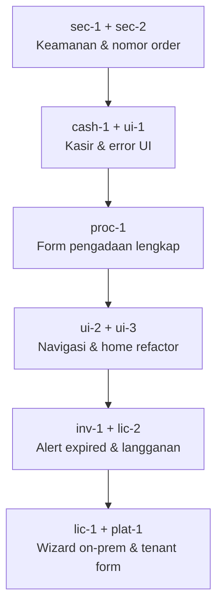

# Audit Optimasi — ApotikFlow

**Produk:** ApotikFlow — Aplikasi Apotik Multi-Tenant  
**Stack:** Flutter (`app/`) · NestJS (`api/`) · PostgreSQL · Prisma  
**Tanggal audit:** Juni 2026  
**Lingkup:** Flow fitur, keamanan, integritas data, konsistensi UI/UX

---

## 1. Ringkasan Eksekutif

Audit ini memetakan area yang **belum dioptimasi** setelah MVP inti (order → apoteker → kasir → bayar, multi-tenant, lisensi on-prem, setup DB, kas cabang) sudah berjalan. Item dikelompokkan ke **Kritis**, **Penting**, dan **Nice-to-have**, dengan referensi file dan ID todolist untuk pelacakan implementasi.

### Baseline yang sudah cukup baik

- Alur order → apoteker → kasir → pembayaran (status + role guard)
- Multi-role + scope cabang (`branch-scope.util.ts`)
- Lisensi on-prem, aktivasi, status untuk Owner
- Super Admin: tenant, lisensi, backup, alamat server & database (beli putus)
- Pencarian barcode di kasir & pengadaan
- Antrian aksi offline terbatas (order/bayar)
- E2E lisensi API (`api/test/license.e2e-spec.ts`)

---

## 2. Temuan Kritis

Risiko operasional, keamanan, atau integritas data yang sebaiknya diprioritaskan.

| ID | Masalah | Dampak | Lokasi |
|----|---------|--------|--------|
| `sec-1` | QRIS webhook publik tanpa autentikasi | Pembayaran lunas bisa dipalsukan | `api/src/modules/payments/payments.controller.ts` — `POST qris/webhook` |
| `sec-2` | Race condition nomor order | Dua order bersamaan bisa nomor duplikat | `api/src/modules/orders/orders.service.ts` — `generateOrderNumber()` (`count + 1` tanpa lock) |
| `sec-3` | Fallback `LICENSE_SECRET` default | Lisensi bisa divalidasi dengan secret lemah jika env kosong | `api/src/modules/license/license.service.ts` |
| `plat-2` | Backup tenant load-all ke memori | Tenant besar berisiko OOM saat backup | `api/src/modules/platform/platform-backup.service.ts` |

### Rekomendasi teknis

**`sec-1` — QRIS webhook**

- Verifikasi signature/HMAC dari provider QRIS sebelum update status `PAID`.
- Tolak request tanpa header signature atau dengan payload tidak valid.
- Log audit untuk setiap callback.

**`sec-2` — Nomor order**

- Gunakan sequence PostgreSQL atau tabel counter dengan `SELECT … FOR UPDATE`.
- Alternatif: UUID + prefix human-readable; hindari `count()` di tengah transaksi tanpa lock.

**`sec-3` — License secret**

- Fail-fast saat startup jika `LICENSE_SECRET` kosong di mode production/on-prem.
- Jangan gunakan nilai default `change-me` di environment produksi.

**`plat-2` — Backup**

- Stream export per tabel (cursor/batch), hindari `findMany` tanpa batas untuk seluruh dataset.
- Pertimbangkan kompresi dan batas ukuran per chunk.

---

## 3. Temuan Penting — Fitur

### 3.1 Pembayaran & kasir

| ID | Masalah | Lokasi |
|----|---------|--------|
| `pay-1` | QRIS masih mock (`qris://mock/...`), belum provider sungguhan | `api/src/modules/payments/payments.service.ts` |
| `cash-1` | Kas cabang belum masuk cetak laporan kasir | `app/lib/features/cashier/…/cashier_report_print.dart` |
| `cash-2` | Manager/Owner punya akses API kas, tapi tidak ada menu UI; edit/hapus entri manual belum ada | `api/src/modules/cash-entries/`, `app/lib/features/cashier/cashier_ledger_page.dart` |

**Yang sudah ada:** modul `cash_entries`, halaman kasir `/cashier/ledger`, ringkasan penjualan + masuk/keluar manual.

### 3.2 Pengadaan & stok

| ID | Masalah | Lokasi |
|----|---------|--------|
| `proc-1` | Form buat pengadaan hanya `medicine_id` + `quantity`; API mendukung batch/harga/expired | `app/lib/features/procurement/…/create_procurement_page.dart` |
| `inv-1` | Alert obat kedaluwarsa (API/cron) belum ada halaman atau notifikasi in-app | `api` — modul expired-alerts; Flutter belum konsumen UI |

### 3.3 Lisensi & on-prem

| ID | Masalah | Lokasi |
|----|---------|--------|
| `lic-1` | Setup server, DB, lisensi, tenant terpisah — belum wizard berurutan | `app/…/server_setup_page.dart`, `database_setup_page.dart`, flow aktivasi lisensi |
| `lic-2` | Subscription alerts hanya log server, belum push/email ke Super Admin | `api/src/modules/…/subscription-alerts.service.ts` |

**Catatan akses:** pengaturan alamat server & database hanya **Super Admin** via Platform (`/platform/server`, `/platform/database`).

### 3.4 Platform & tenant

| ID | Masalah | Lokasi |
|----|---------|--------|
| `plat-1` | Edit tenant: field paket masih `TextField` manual di samping dropdown SaaS; status langganan kurang jelas (tenggang / perpetual / on-prem) | `app/lib/features/platform/…/tenant_form_page.dart`, daftar tenant |

### 3.5 Offline & laporan

| ID | Masalah | Lokasi |
|----|---------|--------|
| `off-1` | Tidak ada banner offline global; kas cabang tidak masuk antrian offline | `app` — offline queue existing; belum connectivity banner |
| `rpt-1` | Dashboard vs sales: satu pakai `payments.amount`, satu pakai `orders.total` — potensi selisih kecil | `api/src/modules/reports/reports.service.ts` |

---

## 4. Temuan Penting — UI/UX

| ID | Pola / masalah | Contoh lokasi |
|----|----------------|---------------|
| `ui-1` | Error state mentah (`Text('$e')`), loading tidak seragam | Banyak halaman kasir, stok, laporan, setup |
| `ui-2` | Navigasi campur `MaterialPageRoute` dan `go_router` | `app/lib/features/home/home_page.dart`, platform admin |
| `ui-3` | `home_page.dart` sangat besar (>1000 baris), sulit dirawat | Pisah quick menu per role ke file terpisah |
| `ui-4` | Login dev: email/password demo ter-prefill | Hanya boleh di flavor `dev`, bukan production build |

### Detail inkonsistensi UI

- **Navigasi:** `home_page.dart` banyak `Navigator.push` + `go_router` — back stack tidak konsisten.
- **Error:** `Exception: …` ditampilkan langsung ke pengguna.
- **Loading:** campuran `LinearProgressIndicator`, `CircularProgressIndicator`, teks polos.
- **Empty state:** kasir/order relatif baik; pengadaan, distribusi, notifikasi masih minimal.
- **Form kas:** amount digits only, tanpa format Rp / validasi visual min-max.
- **Platform admin:** `Navigator.push` untuk tenant/backup, `go_router` untuk server/DB.

### Rekomendasi komponen shared

```
app/lib/shared/widgets/
├── async_loading_view.dart    # loading standar
├── async_error_view.dart      # pesan ramah + retry
└── empty_state_view.dart      # ilustrasi + CTA
```

---

## 5. Nice-to-have

| ID | Item | Catatan |
|----|------|---------|
| `nice-1` | Pagination list | Banyak list Flutter `limit: 100` fixed (tenant, stok, kas, pembayaran) |
| `nice-2` | Sync schema deploy | `deploy/backend/prisma/schema` bisa tertinggal dari `api/prisma` |
| — | Notifikasi push end-to-end | FCM/device token di schema; inbox lokal ada, push belum lengkap di UI |
| — | Pencarian global | Tidak ada search lintas modul |
| — | i18n | Locale `id_ID` diset; teks hardcoded Indonesia (OK untuk pasar lokal) |
| — | Aksesibilitas | Semantic labels & touch target belum distandardisasi |
| — | E2E Flutter | Hanya `widget_test.dart` default |
| — | Thermal print | Laporan kasir web pakai HTML print; native printer tidak di semua flow |

---

## 6. Todolist Implementasi

**Terakhir disinkronkan:** 2 Juni 2026 · **Progres:** 22 selesai · 0 sebagian · 0 belum (todolist §6)

Legenda: `[x]` selesai · `[ ]` belum atau sebagian (detail di baris)

### Kritis — Keamanan & integritas

- [x] `sec-1` Amankan QRIS webhook (auth/signature) — `qris-webhook.guard.ts`, header `x-webhook-secret`, `SkipAuth` pada endpoint webhook
- [x] `sec-2` Fix race condition nomor order (DB sequence/lock) — `pg_advisory_xact_lock` di `generateOrderNumber()`
- [x] `sec-3` Hapus fallback `LICENSE_SECRET` default di production — fail-fast on-prem production di `license.service.ts`
- [x] `plat-2` Optimasi backup tenant — streaming/chunk — batch 500 di `platform-backup.service.ts`

### Fitur — Pembayaran & kas

- [x] `pay-1` Integrasi provider QRIS sungguhan (ganti mock) — env `QRIS_PROVIDER` / `QRIS_BASE_URL`; mode `mock` tetap untuk dev
- [x] `cash-1` Kas cabang masuk cetak laporan kasir — `cashier_report_print.dart` (`cashSummary`, `cashEntries`)
- [x] `cash-2` Menu kas untuk Manager/Owner + edit/hapus entri manual — `/ledger`, `DELETE /cash-entries/:id`

### Fitur — Inventori & pengadaan

- [x] `proc-1` Form pengadaan lengkap: batch, harga, expired per baris — `create_procurement_page.dart`
- [x] `inv-1` Halaman/notifikasi in-app alert obat kedaluwarsa — `/alerts/expired` (`expired_alerts_page.dart`) + tab Kadaluarsa + notifikasi `batch.expired`

### Fitur — Lisensi & platform

- [x] `lic-1` Wizard on-prem: server → DB → lisensi → tenant — `/platform/wizard` (`on_prem_wizard_page.dart`)
- [x] `lic-2` Subscription alerts ke UI/email — cron + `subscription.warning` + email Super Admin via `MailService` (env `SMTP_*`)
- [x] `plat-1` Tenant form: dropdown paket konsisten + status langganan jelas — `tenant_form_page.dart`, label status di `tenants_list_page.dart`

### Fitur — Offline & laporan

- [x] `off-1` Banner offline global + antrian kas offline — `network_online_provider.dart`, banner di `bootstrap.dart`, antrian `CASH_ENTRY`
- [x] `rpt-1` Selaraskan metrik laporan (payments vs orders) — `totals.total` dari `payment.aggregate` di `reports.service.ts`

### UI/UX

- [x] `ui-1` Komponen shared `AsyncErrorView` + loading standar — `empty_state_view.dart`; dipakai di stok, kas, movements, alert kadaluarsa, dashboard cards
- [x] `ui-2` Satukan navigasi ke `go_router` — rute platform/admin/customers/warehouse di `app_router.dart`; sisa `MaterialPageRoute` hanya di `barcode_search_field.dart`
- [x] `ui-3` Refactor `home_page.dart` — pisah menu per role — `home_quick_menu.dart` + `home_dashboard_widgets.dart` (part); `home_page.dart` ~120 baris
- [x] `ui-4` Hapus prefill login demo di production build — `kDebugMode` guard di `login_page.dart`

### Nice-to-have

- [x] `nice-1` Pagination list (ganti limit 100 fixed) — tenant, user, pelanggan, stok, kas, movements, payments API (`PaginationBar`)
- [x] `nice-2` Sync deploy/prisma schema otomatis di `prepare-deploy` — verifikasi hash `schema.prisma` + `deploy-manifest.json`

### Tambahan pasca-audit (di luar ID asli)

- [x] Label UI **Manajer Pusat** vs **Kepala Cabang** — `role_labels.dart`, badge profil, daftar user, role picker (`MANAGER` ± `branchId`)

---

## 7. Urutan Perbaikan yang Disarankan



### Quick wins — **selesai** (Juni 2026)

1. ~~`ui-1`~~ — komponen error/loading shared *(komponen ada; rollout belum penuh)*
2. ~~`cash-1`~~ — integrasi kas cabang ke cetak laporan kasir
3. ~~`ui-4`~~ — hapus prefill login di production
4. ~~`plat-1`~~ — rapikan dropdown paket tenant

### Medium — **selesai** (Juni 2026)

1. ~~`sec-1` + `sec-2`~~ — webhook QRIS + sequence order
2. ~~`proc-1`~~ — form pengadaan lengkap
3. ~~`cash-2`~~ — menu kas Manager + CRUD entri manual
4. ~~`ui-2`~~ — navigasi platform ke `go_router`

### Sisa (estimasi ~3–5 hari)

1. `off-1` — banner offline global
2. `ui-1` + `ui-3` — polish error/loading + pecah sisa `home_page.dart`
3. `lic-2` — email alert langganan
4. `nice-1` — pagination sisa modul

---

## 8. Referensi File Kunci

| Area | Path |
|------|------|
| Pembayaran / QRIS | `api/src/modules/payments/` |
| Order | `api/src/modules/orders/orders.service.ts` |
| Kas cabang API | `api/src/modules/cash-entries/` |
| Kas cabang UI | `app/lib/features/cashier/` |
| Laporan kasir cetak | `app/lib/features/reports/utils/cashier_report_print.dart` |
| QRIS webhook guard | `api/src/modules/payments/qris-webhook.guard.ts` |
| Wizard on-prem | `app/lib/features/setup/presentation/pages/on_prem_wizard_page.dart` |
| Quick menu per role | `app/lib/features/dashboard/presentation/widgets/home_quick_menu.dart` |
| Pagination UI | `app/lib/shared/widgets/pagination_bar.dart` |
| Pengadaan UI | `app/lib/features/procurement/` |
| Lisensi | `api/src/modules/license/` |
| Setup on-prem | `api/src/modules/setup/` |
| Platform tenant | `app/lib/features/platform/` |
| Router | `app/lib/app/router/app_router.dart` |
| Role labels | `app/lib/shared/utils/role_labels.dart` |
| Laporan API | `api/src/modules/reports/reports.service.ts` |
| Backup platform | `api/src/modules/platform/platform-backup.service.ts` |
| E2E lisensi | `api/test/license.e2e-spec.ts` |
| SQL kas | `api/prisma/sql/cash-entries.sql` |

---

## 9. Lingkungan Dev & Akun Demo

| Variabel | Nilai dev umum |
|----------|----------------|
| `DEPLOYMENT_MODE` | `on_prem` |
| `ENABLE_PLATFORM` | `true` |

| Email | Password | Role (DB) | Label UI |
|-------|----------|-----------|----------|
| superadmin@apotikflow.com | password123 | SUPER_ADMIN | Super Admin |
| owner@apotikflow.com | password123 | OWNER | Owner |
| manager@apotikflow.com | password123 | MANAGER (+ cabang) | Kepala Cabang |
| kasir@apotikflow.com | password123 | CASHIER | Kasir |

**Label UI** (`role_labels.dart`):

- `STAFF` → **Asisten** (kode DB tetap `STAFF`)
- `MANAGER` tanpa `branchId` → **Manajer Pusat**
- `MANAGER` dengan `branchId` / `branches[]` → **Kepala Cabang**

**Multi-cabang per user** (2 Juni 2026):

- Tabel junction `user_branches` (`api/prisma/sql/user-branches.sql`)
- API: `branch_ids[]` pada create/update user; response `branches[]`
- Auth: `branch_ids[]` di `/auth/me`; `POST /auth/switch-branch` untuk ganti cabang aktif
- Flutter: multi-select cabang di Kelola User; tombol ganti cabang di home jika >1 cabang

**Peran per cabang** (8 Juni 2026):

- `user_branches.roles[]` + `users.global_roles[]` (`api/prisma/sql/user-branches-roles.sql`)
- API: `branch_assignments[{branch_id, roles}]` + `global_roles[]`
- Sesi: peran aktif harus sesuai cabang aktif; ganti cabang auto-pilih peran di cabang itu
- Flutter: penugasan peran per cabang di Kelola User; dialog sesi filter peran↔cabang

---

## 10. Catatan Pemeliharaan Dokumen

- Perbarui checklist di **§6** setiap item selesai.
- Tambahkan tanggal & commit/PR di baris item jika perlu jejak audit.
- Sinkronkan dengan `referensi/8. roadmap.md` jika item masuk fase roadmap resmi.

### Backlog §6 — selesai (2 Juni 2026)

Semua item todolist §6 sudah `[x]`. Lihat baris item di atas untuk jejak file.

### Catatan lanjutan (di luar §6)

**Todolist aktif:** lihat `referensi/11. backlog belum diterapkan.md` (25 item: P0 deploy, P1 PRD, P2 ops, P3 scale).

| # | Item | Status |
|---|------|--------|
| 1 | Notifikasi push FCM end-to-end | **Sebagian** — `ops-1` di backlog |
| 2 | Pencarian global lintas modul | **Selesai** |
| 3 | Aksesibilitas | **Sebagian** — `ops-6` di backlog |
| 4 | E2E Flutter | **Sebagian** — `scale-3` di backlog |
| 5 | Thermal print | **Sebagian** — `ops-2` di backlog |
| 6 | Rollout `AsyncErrorView` | **Selesai** |
| 7 | Atur server pre-login | **Selesai** — tombol di `login_page.dart` |
| 8 | Checklist kirim beli putus | **Selesai** — `referensi/10. checklist beli putus.md` |

---

*Dokumen ini melengkapi roadmap produk dengan fokus gap operasional pasca-MVP, bukan menggantikan PRD atau desain API.*
